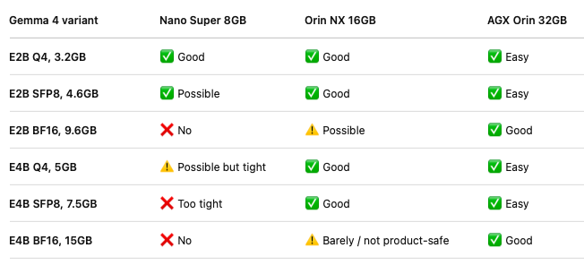

# Gemma Distillation

Tools for replacing Gemma language-model MLP projections with two-factor Monarch
maps, distilling the compressed model from the original teacher, and exporting,
quantizing, and evaluating the result.

## Motivation

This project began with a practical target: reduce the Gemma 4 E2B BF16 weight
footprint enough to fit within the Nano Super 8 GB GPU memory budget. The
original E2B BF16 weights are listed at 9.6 GB, so they do not fit without
compression or quantization.



## Published Models

| Variant | Status | Hugging Face | Description |
| --- | --- | --- | --- |
| 35-layer Monarch BF16 | Released | [Model card](https://huggingface.co/hexoy/gemma-4-e2b-monarch-35mlp) | All 35 language-model MLPs use two-factor Monarch projections. |
| 35-layer Monarch + INT8 linears | Released | [Model card](https://huggingface.co/hexoy/gemma-4-e2b-monarch-35mlp-int8) | Weight-only INT8 quantization for 420 remaining standard linear layers. |
| 35-layer Monarch + LoRA r8 | Experimental | [Model card](https://huggingface.co/hexoy/gemma-4-e2b-monarch-35mlp-lora-r8) | Rank-8 recovery adapters; not reliable for extended text or image-text generation. |

The model cards contain loading instructions, storage measurements, limitations,
and TinyHellaSwag results.

## Quick Start

Install a CUDA-compatible PyTorch build for your environment, then install the
base dependencies:

```bash
python3 -m venv .venv
source .venv/bin/activate
pip install -r requirements/base.txt
```

Set a Hugging Face token when the source model or a Hub operation requires one:

```bash
export HF_TOKEN=your_huggingface_token
```

## Workflows

### Distill Monarch MLPs

Edit `CompressionConfig` defaults in `monarch_distill/config.py`, then run:

```bash
python main.py
```

The trainer writes TensorBoard events and cumulative layer checkpoints locally.
For resumed runs, consolidate scalar events with:

```bash
python -m scripts.consolidate_tensorboard tensorboard_raw/RUN_NAME \
  --output-dir tensorboard_logs/RUN_NAME
```

### Export and Validate

Export a cumulative checkpoint or verify an exported Hugging Face model:

```bash
python -m scripts.export_hf --help
python -m scripts.verify_hf_model --help
```

### Recover With LoRA

```bash
pip install -r requirements/recovery.txt
python -m scripts.train_lora_recovery
python -m scripts.export_lora_hf --help
```

### Quantize Remaining Linear Weights

```bash
pip install -r requirements/quantization.txt
python -m scripts.quantize_hf --help
```

### Benchmark TinyHellaSwag

```bash
pip install -r requirements/benchmark.txt
python -m scripts.benchmark_tinyhellaswag --model google/gemma-4-E2B-it
python -m scripts.compare_tinyhellaswag --help
```

## Repository Layout

```text
main.py             Stable compression entrypoint
monarch_distill/    Reusable distillation, model, loss, storage, and benchmark code
scripts/            Export, quantization, recovery, validation, and benchmark commands
requirements/       Dependency sets for each workflow
tests/              Unit coverage for package and command contracts
```

## Notes

- Compression targets language-model MLPs only; attention, embeddings, vision,
  audio, and the LM head remain unchanged unless a workflow explicitly says otherwise.
- This repository excludes weights, checkpoints, datasets, TensorBoard logs, and
  experiment artifacts. Store large outputs outside Git.
- Monarch models include custom code and require `trust_remote_code=True` when
  loaded through Transformers. Review the model card and code before enabling it.

## Credits and License

Co-author: Yusuf Kalyoncuoglu.

Derived models are based on [Google Gemma 4 E2B IT](https://huggingface.co/google/gemma-4-E2B-it).
This repository is licensed under [Apache-2.0](LICENSE).
